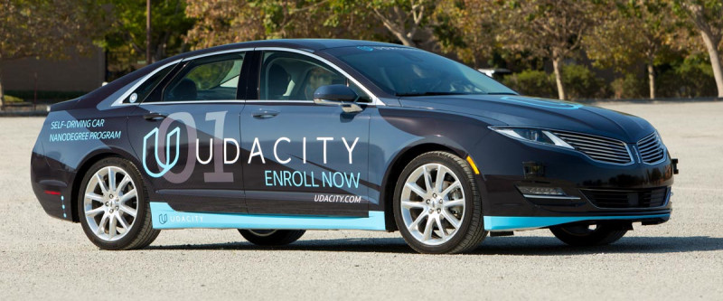
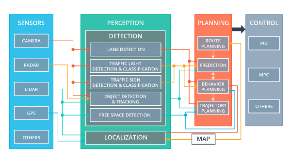

# Self Driving Car Nano Degree Capstone Project

The System Integration project is the final project of the Udacity Self-Driving Car Engineer Nanodegree. This project is all about applying the knowledge that a student would have gained in the past 9 months of this Nano Degree program across various modules like Computer Vision, Deep Learning, Transfer Learning, Sensor Fusion and Path planning. The goal of this project is to code a real self-driving car to drive itself on a test track using ROS and Autoware. The project is coded to run on Udacity simulator. 



## Project Overview

### Carla Architecture

Carla is the custom Lincoln MKZ that Udacity has converted into a self-driving car. It's self-driving system is broken down into four major sub-systems: **Sensors, Perception, Planning** and **Control**.



* **Sensors:** Includes everything needed to understand its surroundings and location including cameras, lidar, GPS, radar, and IMU
* **Perception:** Sensing the environment to perceive obstacles, traffic hazards as well as traffic lights and road signs.
* **Planing:** Route planning to a given goal state using data from localization, perception and environment maps.
* **Control:**  Actualising trajectories formed as part of planning, in order to actuate the vehicle through steering, throttle and brake commands.

### ROS Architecture

The ROS Architecture consists of different nodes that communicate with each other via ROS messages. The nodes and their communication with each other are depicted in the picture below.


## Implementation Details

### Planning Module (Waypoint Updater)

This node publishes the next 200 waypoints that are closest to vehicle's current location and are ahead of the vehicle. This node also considers obstacles and traffic lights to set the velocity for each waypoint.

This node subscribes to following topics:

**base_waypoints:** Waypoints for the whole track are published to this topic. This publication is a one-time only operation. The waypoint updater node receives these waypoints, stores them for later use and uses these points to extract the next 200 points ahead of the vehicle.

**traffic_waypoint:** To receive the index of the waypoint in the base_waypoints list, which is closest to the red traffic light so that the vehicle can be stopped. The waypoint updater node uses this index to calculate the distance from the vehicle to the traffic light if the traffic light is red and the car needs to be stopped.

**current_pose:** To receive current position of vehicle.

### Controller Module (Twist Controller)

The functionality of the waypoint updater node is to process the track waypoints that are provided from the waypoint_loader and provide the next waypoints that the car will follow. The speed is adjusted in the presence of a red traffic light ahead.


This is the project repo for the final project of the Udacity Self-Driving Car Nanodegree: Programming a Real Self-Driving Car. For more information about the project, see the project introduction [here](https://classroom.udacity.com/nanodegrees/nd013/parts/6047fe34-d93c-4f50-8336-b70ef10cb4b2/modules/e1a23b06-329a-4684-a717-ad476f0d8dff/lessons/462c933d-9f24-42d3-8bdc-a08a5fc866e4/concepts/5ab4b122-83e6-436d-850f-9f4d26627fd9).

Please use **one** of the two installation options, either native **or** docker installation.

### Native Installation

* Be sure that your workstation is running Ubuntu 16.04 Xenial Xerus or Ubuntu 14.04 Trusty Tahir. [Ubuntu downloads can be found here](https://www.ubuntu.com/download/desktop).
* If using a Virtual Machine to install Ubuntu, use the following configuration as minimum:
  * 2 CPU
  * 2 GB system memory
  * 25 GB of free hard drive space

  The Udacity provided virtual machine has ROS and Dataspeed DBW already installed, so you can skip the next two steps if you are using this.

* Follow these instructions to install ROS
  * [ROS Kinetic](http://wiki.ros.org/kinetic/Installation/Ubuntu) if you have Ubuntu 16.04.
  * [ROS Indigo](http://wiki.ros.org/indigo/Installation/Ubuntu) if you have Ubuntu 14.04.
* [Dataspeed DBW](https://bitbucket.org/DataspeedInc/dbw_mkz_ros)
  * Use this option to install the SDK on a workstation that already has ROS installed: [One Line SDK Install (binary)](https://bitbucket.org/DataspeedInc/dbw_mkz_ros/src/81e63fcc335d7b64139d7482017d6a97b405e250/ROS_SETUP.md?fileviewer=file-view-default)
* Download the [Udacity Simulator](https://github.com/udacity/CarND-Capstone/releases).

### Docker Installation
[Install Docker](https://docs.docker.com/engine/installation/)

Build the docker container
```bash
docker build . -t capstone
```

Run the docker file
```bash
docker run -p 4567:4567 -v $PWD:/capstone -v /tmp/log:/root/.ros/ --rm -it capstone
```

### Port Forwarding
To set up port forwarding, please refer to the [instructions from term 2](https://classroom.udacity.com/nanodegrees/nd013/parts/40f38239-66b6-46ec-ae68-03afd8a601c8/modules/0949fca6-b379-42af-a919-ee50aa304e6a/lessons/f758c44c-5e40-4e01-93b5-1a82aa4e044f/concepts/16cf4a78-4fc7-49e1-8621-3450ca938b77)

### Usage

1. Clone the project repository
```bash
git clone https://github.com/udacity/CarND-Capstone.git
```

2. Install python dependencies
```bash
cd CarND-Capstone
pip install -r requirements.txt
```
3. Make and run styx
```bash
cd ros
catkin_make
source devel/setup.sh
roslaunch launch/styx.launch
```
4. Run the simulator

### Real world testing
1. Download [training bag](https://s3-us-west-1.amazonaws.com/udacity-selfdrivingcar/traffic_light_bag_file.zip) that was recorded on the Udacity self-driving car.
2. Unzip the file
```bash
unzip traffic_light_bag_file.zip
```
3. Play the bag file
```bash
rosbag play -l traffic_light_bag_file/traffic_light_training.bag
```
4. Launch your project in site mode
```bash
cd CarND-Capstone/ros
roslaunch launch/site.launch
```
5. Confirm that traffic light detection works on real life images
